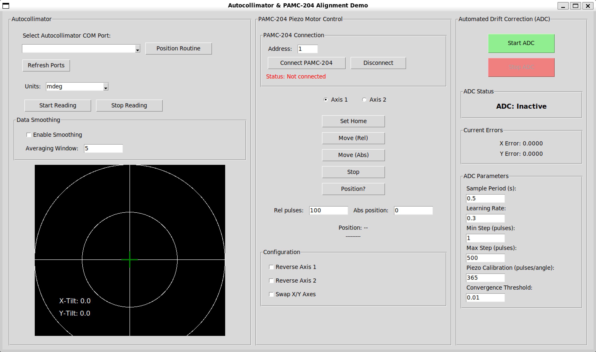

# Autocollimator & Piezo Motor Alignment Demo

オートコリメータ（自動準直器）とピエゾモーターコントローラーを組み合わせた、
**自動ドリフト補正（ADC: Automated Drift Correction）** デモアプリケーションです。

対応コントローラー:

- **PAMC-204**（DLL 経由、デフォルト）
- **PAMC-104**（RS232C 直接通信、`--mode pamc104`）

---

## デモ動画
[リンク](https://s3.ap-northeast-1.wasabisys.com/marketingmaterial/Active%20Laser%20Beam%20Stabilization%20Systems_.mp4)参照

## 画面概要



画面は左から **Autocollimator**・**Piezo Motor Control**・**Automated Drift Correction (ADC)** の3パネル構成です。

---

## 何をするプログラムか

| 機能 | 説明 |
| --- | --- |
| **オートコリメータ読み取り** | シリアル通信でオートコリメータから X/Y 傾き角度を連続取得し、リアルタイム表示する |
| **ピエゾモーター手動制御** | DLL または RS232C 経由でピエゾモーターを手動で相対移動・停止できる |
| **自動ドリフト補正（ADC）** | オートコリメータの誤差をゼロに近づけるよう、ピエゾモーターを自動制御する（勾配降下法） |
| **自動軸振り分け** | Axis 1/2 と X/Y 軸の対応関係・パルス方向を自動判定し、Reverse / Swap 設定を自動設定する |
| **ポジションルーティン** | 事前定義された複数の目標位置を順番に移動し、各位置で ADC 収束を待つ自動シーケンス |
| **データロギング** | 測定データ（時刻・X/Y 角度）を CSV 形式でファイル保存する |

### ADC（自動ドリフト補正）の動作原理

```text
オートコリメータ → 角度誤差を計算 → ピエゾモーター ch1/ch2 を順次駆動 → 誤差を縮小
```

- コントローラーは **同時2軸駆動非対応** のため、X軸 → Y軸 の順に **順次駆動**
- X・Y 両軸の誤差はステップ開始時に一度だけ計算し、X 駆動後に再計算しない
- 収束閾値以下の誤差は補正しない（オーバーシュート防止）
- キャリブレーション: 1000パルス ≈ 2.74 単位角度（≈ 365 pulses/unit）
- **軸対応**: Axis 1 = Y軸、Axis 2 = X軸（Swap X/Y = OFF のデフォルト設定）

---

## ファイル構成

```text
demo/
├── __init__.py              # パッケージ初期化
├── main.py                  # エントリーポイント ← ここから起動
├── gui.py                   # メイン GUI クラス（ADCGUI）・モード定義（PiezoMode）
├── pamc204_wrapper.py       # PAMC-204 DLL ラッパー（PAMC204 クラス）
├── pamc104_wrapper.py       # PAMC-104 RS232C 直接通信ラッパー（PAMC104 クラス）
├── ac_thread.py             # オートコリメータ読み取りスレッド（AcThread）
├── adc_thread.py            # ADC 制御スレッド（ADCControlThread）
├── auto_divisioner.py       # 自動軸振り分けスレッド（AutoDivisionerThread）
└── position_routine.py      # ポジションルーティンスレッド（PositionRoutineThread）
```

---

## 必要環境

- **OS**: Windows（pamc204.dll は Windows 専用）
- **Python**: 3.10 以上
- **依存ライブラリ**:

```bash
pip install pyserial numpy
```

- **pamc204.dll**: PAMC-204 モード使用時は `demo/` フォルダに配置すること

---

## 実行方法

```bash
# 1. demo/ フォルダに移動
cd demo

# 2. 起動（PAMC-204 DLL モード、デフォルト）
python main.py

# DLL パスを明示指定する場合
python main.py --dll ./pamc204.dll  --mode pamc204

# PAMC-104 RS232C 直接通信モードで起動する場合
python main.py --mode pamc104

# PAMC-104 + COMポートを引数で指定する場合（GUI での選択を省略できる）
python main.py --mode pamc104 --port COM3
```

### モード一覧

| `--mode` | 対応コントローラー | 使用ラッパー | 接続方式 |
| --- | --- | --- | --- |
| `pamc204`（デフォルト） | PAMC-204 | `pamc204_wrapper.py` | DLL の高レベル API を使用 |
| `pamc104` | PAMC-104 | `pamc104_wrapper.py` | RS232C 直接通信（115200bps）。`--port COM3` でポートを指定するか、GUI で選択して接続 |

### オプション一覧

| オプション | 説明 | 例 |
| --- | --- | --- |
| `--mode` | ピエゾモーター制御モード（`pamc204` / `pamc104`） | `--mode pamc104` |
| `--dll` | pamc204.dll のパスを明示指定（`pamc204` モードのみ） | `--dll ./pamc204.dll` |
| `--port` | PAMC-104 のシリアルポートを指定（`pamc104` モードのみ）。省略時は GUI で選択 | `--port COM3` |

---

## PAMC-104 コマンド仕様

PAMC-104 は RS232C 経由でコマンドを直接送信します（アドレス指定なし）。

| コマンド | 説明 | 例 | 返答 |
| --- | --- | --- | --- |
| `CON` | 通信確認 | `CON` | `OK` |
| `INF` | バージョン確認 | `INF` | `PAMC-104 Ver:0.8.0` |
| `NRffffnnnnA` | 正方向駆動（4桁パルス） | `NR15000010A` | `OK`→`FIN` |
| `RRffffnnnnA` | 逆方向駆動（4桁パルス） | `RR15000010A` | `OK`→`FIN` |
| `NRffffXnnnnnnA` | 正方向駆動（6桁拡張、fw0.8.0以降） | `NR1500X000100A` | `OK`→`FIN` |
| `S` | 駆動停止 | `S` | `FIN nnnnn` |

- `ffff`: 駆動周波数（1〜1500 Hz、4桁）
- `nnnn`: 駆動パルス数（0000〜9999、0000=連続駆動）
- `A`〜`D`: 軸指定（A=ch1, B=ch2, C=ch3, D=ch4）

通信パラメータ: 115200bps / 8bit / パリティなし / ストップビット1 / フロー制御なし / デリミタ CR+LF

---

## 各パネルの説明と操作手順

### 左パネル: Autocollimator

オートコリメータの接続・読み取り・表示を行います。

#### 接続

1. **「Refresh Ports」** をクリックしてシリアルポート一覧を更新
2. ドロップダウンから COM ポートを選択（選択と同時に接続・単位取得）
3. **「Units」** ドロップダウンで角度単位を選択（`min` / `deg` / `mdeg` / `urad`）
4. **「Start Reading」** をクリックして連続読み取り開始
5. 停止するときは **「Stop Reading」** をクリック

#### Position Routine

- **「Position Routine」** ボタンで事前定義された5点を自動巡回（詳細は後述）

#### Data Smoothing（データ平滑化）

| 設定 | 説明 |
| --- | --- |
| Enable Smoothing | チェックで移動平均フィルタを有効化 |
| Averaging Window | 平均化するサンプル数（デフォルト: 5） |

#### 表示キャンバス

- **赤い十字線**: 現在のオートコリメータ測定値（X-Tilt / Y-Tilt）
- **緑の十字線**: ADC の目標位置（ポジションルーティン中に更新）
- 左下に `X-Tilt` / `Y-Tilt` の数値を表示

---

### 中央パネル: Piezo Motor Control

ピエゾモーターコントローラーへの接続と手動操作を行います。

#### 接続（PAMC-204 モード）

1. **「Address」** にデバイスアドレスを入力（デフォルト: `1`）
2. **「Connect PAMC-204」** をクリック
   - 成功: `Status: Connected (addr=1)` が緑色で表示
   - 失敗: `Status: Connection failed` が赤色で表示
   - **接続成功時に全チャンネルの速度が 1500 Hz に自動設定される**
3. 切断するときは **「Disconnect」** をクリック

#### 接続（PAMC-104 モード）

1. **「Refresh」** をクリックしてシリアルポート一覧を更新
2. ドロップダウンから COM ポートを選択
3. **「Connect PAMC-104」** をクリック
   - `CON` コマンドで通信確認し、成功すれば `Status: Connected (COMx)` が緑色で表示
4. 切断するときは **「Disconnect」** をクリック

#### 軸選択

- **「Axis 1」** / **「Axis 2」** ラジオボタンで操作対象軸を選択

#### 手動操作ボタン

| ボタン | 動作 |
| --- | --- |
| **Set Home** | 選択軸の現在位置をホームポジション（0）に設定（`pamc204` モードのみ） |
| **Move (Rel)** | 「Rel pulses」欄のパルス数だけ相対移動（正: 正方向、負: 負方向） |
| **Move (Abs)** | 「Abs position」欄の絶対位置へ移動（`pamc204` モードのみ） |
| **Stop** | 動作を停止 |
| **Position?** | 現在位置を問い合わせて表示（`pamc204` モードのみ） |

#### 入力欄

| 欄 | 説明 |
| --- | --- |
| **Rel pulses** | 相対移動のパルス数（デフォルト: 100） |
| **Abs position** | 絶対移動の目標位置（デフォルト: 0、`pamc204` モードのみ） |

#### Configuration（軸設定）

| 設定 | 説明 |
| --- | --- |
| **Reverse Axis 1** | 軸1のパルス方向を反転（物理的な取り付け方向に合わせて調整） |
| **Reverse Axis 2** | 軸2のパルス方向を反転 |
| **Swap X/Y Axes** | X/Y 軸の割り当てを入れ替え（デフォルト: X→ch2, Y→ch1） |
| **Auto Axis Assignment** | 上記3つの設定を自動で決定する（詳細は後述） |

**軸割り当ての詳細:**

| Swap X/Y | X 軸（オートコリメータ X-Tilt） | Y 軸（オートコリメータ Y-Tilt） |
| --- | --- | --- |
| OFF（デフォルト） | ch2（Axis 2） | ch1（Axis 1） |
| ON | ch1（Axis 1） | ch2（Axis 2） |

> **実機での確認済み構成**: Axis 1 = Y軸、Axis 2 = X軸（Swap X/Y = OFF のデフォルト設定）
>
> 物理的な取り付け方向によってパルス方向が逆になる場合は **Reverse Axis 1 / 2** で反転してください。

---

### 右パネル: Automated Drift Correction (ADC)

オートコリメータの誤差を自動補正します。

#### 操作

1. オートコリメータ読み取りとコントローラー接続が完了していることを確認
2. **ADC Parameters** を必要に応じて調整
3. **「Start ADC」**（緑ボタン）をクリック → 自動補正開始
   - `ADC Status` が **ADC: Active** に変わる
4. **「Stop ADC」**（赤ボタン）で停止

#### ADC Status

| 表示 | 意味 |
| --- | --- |
| **ADC: Inactive** | 停止中 |
| **ADC: Active** | 補正動作中 |

#### Current Errors

- **X Error**: 現在の X 軸誤差（目標値との差）
- **Y Error**: 現在の Y 軸誤差（目標値との差）

#### ADC Parameters

| パラメータ | デフォルト | 説明 |
| --- | --- | --- |
| **Sample Period (s)** | 0.5 | ADC 制御ループの周期（秒） |
| **Learning Rate** | 0.3 | 補正ゲイン（0〜1）。大きいほど積極的に補正するが振動しやすい。適応学習率: 実効ゲイン = Learning Rate × clamp(誤差/0.1, 0.1, 1.0) |
| **Min Step (pulses)** | 1 | 最小補正パルス数（計算値がこれより小さい場合は切り上げ） |
| **Max Step (pulses)** | 500 | 最大補正パルス数（1ステップの上限） |
| **Piezo Calibration (pulses/angle)** | 365 | 1単位角度あたりのパルス数（≈ 1000 / 2.74） |
| **Convergence Threshold** | 0.01 | 収束判定の誤差閾値（この値以下で補正しない） |

---

## パラメータのカスタマイズ

デバイスや実験系が変わった場合は [`demo/adc_thread.py`](adc_thread.py) 冒頭のモジュール定数を変更してください。
GUI の **ADC Parameters** 欄からも実行時に上書きできますが、起動時のデフォルト値はここで決まります。

```python
# demo/adc_thread.py（冒頭の定数ブロック）

# 補正ゲイン（0〜1）。大きいほど積極的に補正するが振動しやすい。
ADC_LEARNING_RATE: float = 0.3

# 最小補正パルス数
ADC_MIN_STEP_PULSES: int = 1

# 最大補正パルス数（1ステップの上限）
ADC_MAX_STEP_PULSES: int = 500

# キャリブレーション: 1000パルス = 2.74単位角度 → ~365 pulses/unit
# デバイスや取り付け条件が変わった場合はここを変更する。
ADC_PULSES_PER_UNIT: float = round(1000 / 2.74, 2)  # ~365

# 収束判定閾値（単位角度）。誤差がこの値以下なら補正しない。
ADC_CONVERGENCE_THR: float = 0.01

# 制御ループ周期（秒）
ADC_SAMPLE_PERIOD: float = 0.5
```

### 調整のガイドライン

| 症状 | 対処 |
| --- | --- |
| 補正が遅い・収束しない | `ADC_LEARNING_RATE` を大きくする（例: 0.3 → 0.5） |
| 振動・オーバーシュートする | 下記「オーバーシュートの対処」を参照 |
| 微小誤差で無駄に動き続ける | `ADC_CONVERGENCE_THR` を大きくする（例: 0.01 → 0.05） |
| 1ステップが大きすぎる | `ADC_MAX_STEP_PULSES` を小さくする（例: 500 → 100） |
| キャリブレーションがずれている | 実測値から `ADC_PULSES_PER_UNIT` を再計算して変更する |

### オーバーシュートの対処

オーバーシュートとは、補正が目標値を超えて逆方向に誤差が発生し、振動・発散する現象です。
以下のパラメータが原因になりえます（影響度順）。

**① `ADC_LEARNING_RATE`（最も影響大）**

適応学習率の式: `実効ゲイン = ADC_LEARNING_RATE × clamp(|error| / 0.1, 0.1, 1.0)`

誤差が `0.1` 以上のときはフルゲインで動くため、値が大きすぎると1ステップで目標を超える。

```text
例: 誤差=1.0, ADC_LEARNING_RATE=0.3, ADC_PULSES_PER_UNIT=365
→ 補正パルス = 0.3 × 1.0 × 365 = 109 パルス
```

→ **`0.1〜0.15` に下げることを最初に試す**

**② `ADC_MAX_STEP_PULSES`（1ステップ上限）**

現在値 `500` はほぼ効いていない。大誤差時の暴走を防ぐには `50〜100` に下げる。
`ADC_LEARNING_RATE` を下げても収まらない場合に追加で調整する。

**③ `ADC_PULSES_PER_UNIT`（キャリブレーション誤差）**

実際のデバイスとキャリブレーション値がずれていると、計算上は正しくても実際にはオーバーシュートする。
既知の誤差量とパルス数から実測値を求めて設定する:

```python
ADC_PULSES_PER_UNIT = round(実測パルス数 / 実測変位量, 2)
```

**④ `ADC_CONVERGENCE_THR`（収束判定閾値）**

閾値付近で補正と逆補正を繰り返す場合は `0.01` → `0.03〜0.05` に上げる。

---

## 自動軸振り分け（Auto Axis Assignment）

Configuration セクションの **「Auto Axis Assignment」** ボタンで、Reverse Axis 1/2 と Swap X/Y Axes を自動設定します。

### 前提条件

- オートコリメータ接続済み・読み取り中
- ピエゾモーターコントローラー接続済み
- 角度単位が **deg** に設定されていること
- ADC が停止中であること

### 動作手順

| ステップ | 動作 |
| --- | --- |
| 1 | 現在の角度を読み取る |
| 2 | Axis 1 を +3000 パルス駆動し、駆動完了を待つ |
| 3 | 角度を読み取り、X/Y のうち角度差が大きい方を Axis 1 の対応軸とする。差が負なら Reverse Axis 1 を有効化 |
| 4 | Axis 2 を +3000 パルス駆動し、駆動完了を待つ |
| 5 | 角度を読み取り、ステップ3 と異なる軸を Axis 2 の対応軸とする。差が負なら Reverse Axis 2 を有効化 |
| 6 | Axis 1 が X 軸に対応していた場合、Swap X/Y Axes を有効化（Axis 1 = Y 軸にするため） |
| 7 | 検証: Axis 1 を +3000 駆動し、Y 軸の角度差 > 0 を確認 |
| 8 | 検証: Axis 2 を +3000 駆動し、X 軸の角度差 > 0 を確認 |
| 9 | ステップ 7 または 8 が失敗した場合はエラーを表示。結果に関係なく終了 |

### Pulse Calibration 自動設定

検証ステップ（7・8）で得られた角度差から `Pulse Calibration = 3000 / Δdeg` を自動計算し、ADC パラメータの **Piezo Calibration (pulses/angle)** に自動反映します。

---

## ポジションルーティン

「Position Routine」ボタンで以下の5点を自動巡回します。

| ステップ | 目標位置 (X, Y) | ホールド時間 |
| --- | --- | --- |
| 1 | (+7.0, -7.0) | 2秒 |
| 2 | (-7.0, -7.0) | 2秒 |
| 3 | (-7.0, +7.0) | 2秒 |
| 4 | (+7.0, +7.0) | 2秒 |
| 5 | (0.0, 0.0) | 原点復帰 |

各位置で ADC が**連続5回**収束閾値内に収まるまで待機（最大30秒）してからホールドします。

**前提条件**: オートコリメータ読み取り中・コントローラー接続済みであること

---

## データロギング

画面下部のロギングパネルで測定データを記録・保存できます。

1. **「Start Test」** でロギング開始
2. **「Stop Test」** で停止
3. **「Save Data to File」** で `.txt` ファイルに保存

保存形式（タブ区切り）:

```text
Time(s)    alnx        alny
0.000000   0.001234    -0.000567
0.100000   0.001189    -0.000512
...
```
